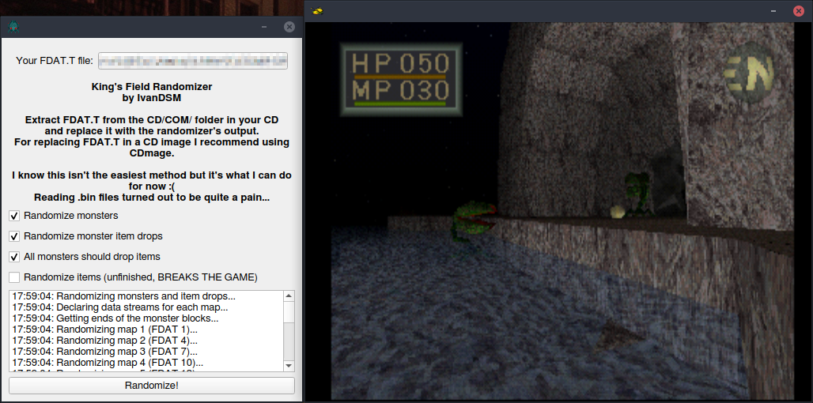

# KingsFieldRE
King's Field (II) Reverse Engineering Tools and Documentation

This repository contains tools and documentation for reverse engineering King's Field (II).

This is the fruit of my efforts in decompiling and understanding how the game works and is here in the hopes that it might provide help to those who are interested in helping reverse engineer the game.

The tools are available in the repository, and documentation is available in the wiki. As of writing, the wiki is incomplete and new pieces of documentation will be added as soon as possible.

# Tools

All the tools in KingsFieldRE are written using C++11 and the Qt Framework.

Automated builds for Linux (based on Ubuntu 16.04) and 64-bit Windows are available on the project's [GitHub Actions page](https://github.com/IvanDSM/KingsFieldRE/actions). Just select the latest run (the first run on the page)! 

You will need to be signed into GitHub to download the automated builds due to GitHub limitations. **We do not receive any information about you when you download a build.**

## checksum_tool
This is a very simple command line tool for calculating a file's checksum according to the way the game calculates it for integrity checking. The game's method for calculating a file's checksum is described [in the repository's wiki](https://github.com/IvanDSM/KingsFieldRE/wiki/File-Checksum-Algorithm).

## fdat28_tool
This is a graphical tool for interpreting the data contained in FDAT.T's (true) file 28. This file contains data such as weapon stats for each weapon in the game, data for each of the magic spells and the player stats for each achievable level.

## HexOffsetFinder
This tool is a simple single-purpose utility. It receives text files with increasingly ordered hexadecimal values (such as the ones in the Notes folder), finds the offsets between the values and prints out a sorted list of them. This tool is used to find the size of newly found structures.

## KFRandomizer
A badly written prototype of a randomizer for King's Field!

Currently able to replace monsters and their item drops in all maps. Item randomization is being worked on but currently breaks the game if activated.

## tfile_tool
This is a command line tool for extracting data files from the King's Field (II) CD. It has the ability to give files descriptive names when they have been identified and added to it's internal table.

tfile_tool has also been confirmed to work for Shadow Tower T files.

# Credit where it's due
tfile_tool is heavily based on the TheStolenBattenberg's [Psycpros](https://github.com/TheStolenBattenberg/Psycpros) project.

Monster Mesh IDs were mostly found in [Shrine Maiden's King's Field II code page](http://mikosans.web.fc2.com/code/kings-field-2.html)
