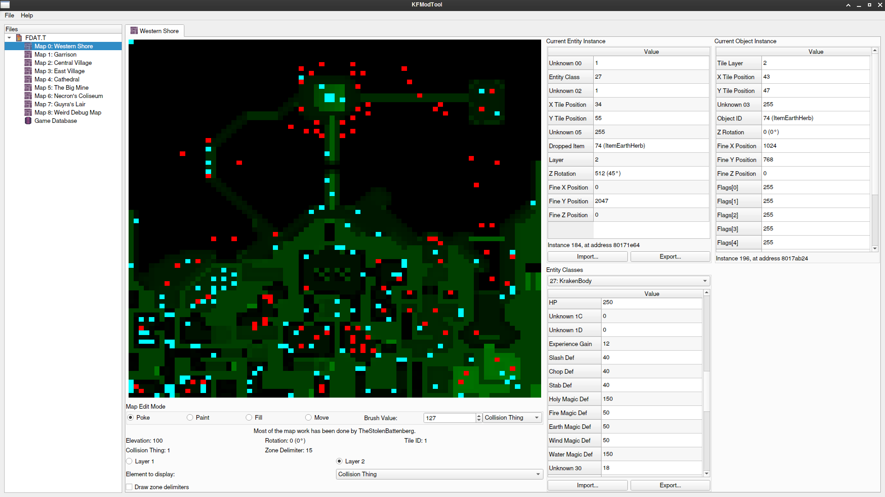
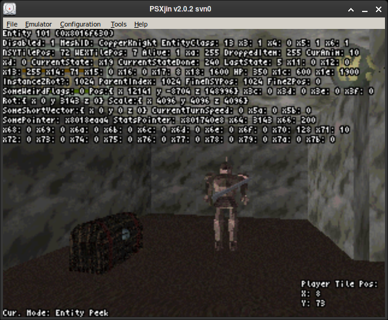

# KingsFieldRE
King's Field (II) Reverse Engineering Tools and Documentation

This repository contains tools and documentation for reverse engineering King's Field (II).

This is the fruit of the community's efforts in understanding how the game works and is here in the hopes that it might provide help to those who are interested in helping reverse engineer the game.

The tools are available in the repository, and documentation is available in the wiki. As of writing, the wiki is incomplete and it is often outdated, but it is updated whenever possible.

If you need help with the tools or would like to discuss King's Field internals and reverse engineering, join [The FromSoft Modding Committee Discord Server](https://discord.gg/jUzZwWWUXd)!

For King's Field IV Tools and Documentation, check out [TheStolenBattenberg's ToolsForKFIV](https://github.com/TheStolenBattenberg/ToolsForKFIV)!

# Tools

All the tools in KingsFieldRE are written using C++17 and the Qt Framework.

Automated builds for 64-bit Linux (cross-distribution AppImages based on Ubuntu 16.04) and Windows are available on the project's [Releases page](https://github.com/IvanDSM/KingsFieldRE/releases).

## KFModTool
Early modding/datamining tool for King's Field. Breaks often, so be careful!

Features:

* Basic map editing with 3D preview, including editing entities and objects.
* Game Database editing, enabling you to modify armor stats, object classes, spell attributes, player level data, and weapon stats.
* Game Executable editing, allowing you to edit strings and shop info. (KF1U only so far)
* Texture viewing, exporting and replacement
* 3D model viewing (no support for animated KF1J models yet!)

KFModTool currently supports loading files from the following games:

* Armored Core [SCUS-94182, SLUS-01323]
* Armored Core Demo from Interactive CD Sampler Volume 4 [SCUS-94418]
* Armored Core "Preview Only 7-3-97" Prototype
* King's Field I [SLPS 00017, SLPS 03578]
* King's Field I Demo from DemoDemo PlayStation Soukan-gou Vol. 1 [PCPX 96003]
* King's Field II [NPJJ-00083, SCES-00510, SLPS-00069, SLPS-03579, SLPS-91003, SLPS-91423, SLUS-00158]
* King's Field III [SLPS-00377, SLPS-03580, SLPS-91089, SLUS-00255]
* King's Field III: Pilot Style [SLPM-80029]
    * KFModTool also supports loading the King's Field 3 demo present in the Pre-Pre Vol. 3 disc [PCPX-96028]. It has the same content as Pilot Style, but has limited time.
* Shadow Tower [SLPS-01420, SLUS-00863]
* Shadow Tower Demo from PlayStation Underground v2.4 [SCUS-94298]

**BEWARE:** The main focus is still KF2. King's Field 3 maps will load but will have incorrect entity/sound/weapon names and missing objects since we haven't documented KF3 yet and the KF2 names are loaded instead. Support for all games except KF2 is only for loading model and texture files.

## checksum_tool
This is a very simple command line tool for calculating a file's checksum according to the way the game calculates it for integrity checking. The game's method for calculating a file's checksum is described [in the repository's wiki](https://github.com/IvanDSM/KingsFieldRE/wiki/File-Checksum-Algorithm).

## HexOffsetFinder
This tool is a simple single-purpose utility. It receives text files with increasingly ordered hexadecimal values (such as the ones in the Notes folder), finds the offsets between the values and prints out a sorted list of them. This tool is used to find the size of newly found structures.

## KFMiniScripts
KFMiniScripts is a collection of scripts to aid in reverse engineering King's Field (II) and testing concepts. 

kfminiscripts.py is a Python module with functions relevant to King's Field (II) reverse engineering. The objective of this tool is to make it easy to replicate smaller parts of game logic for analytical purposes such as route planning or other kinds of estimations.

KFPeek.lua is a Lua script for the psxjin emulator that (currently) allows the user to watch entity and object values in real time. The entity indexes match up with the instance IDs in KFModTool. KFPeek **must** be used with the USA version of King's Field (II).

## KFRandomizer
A badly written prototype of a randomizer for King's Field!

KFRandomizer is able to replace monsters (as well as their item drops) and items in all maps (the screenshot below is of an old build). Item randomization is being worked on but currently breaks the game if activated.

There is a manual available [here](https://github.com/IvanDSM/KingsFieldRE/blob/master/Tools/KFRandomizer/README.md) and ImJecht has made [a tutorial on how to set up and use it](https://youtu.be/VHVXxpg4R5I)!

## tfile_tool
This is a command line tool for extracting data files from the King's Field (II) CD. It has the ability to give files descriptive names when they have been identified and added to it's internal table.

tfile_tool has also been confirmed to work for Shadow Tower T files.

# Credit where it's due
tfile_tool is heavily based on the TheStolenBattenberg's [Psycpros](https://github.com/TheStolenBattenberg/Psycpros) project.

Monster Mesh IDs were mostly found in [Shrine Maiden's King's Field II code page](http://mikosans.web.fc2.com/code/kings-field-2.html).

A lot of the work discovering fields of the map file structures was done by Mendzen.

KFModTool uses the [libimagequant](https://pngquant.org/lib/) library, which is licensed under the [GPLv3 with additional copyright notices](https://raw.githubusercontent.com/ImageOptim/libimagequant/master/COPYRIGHT).
